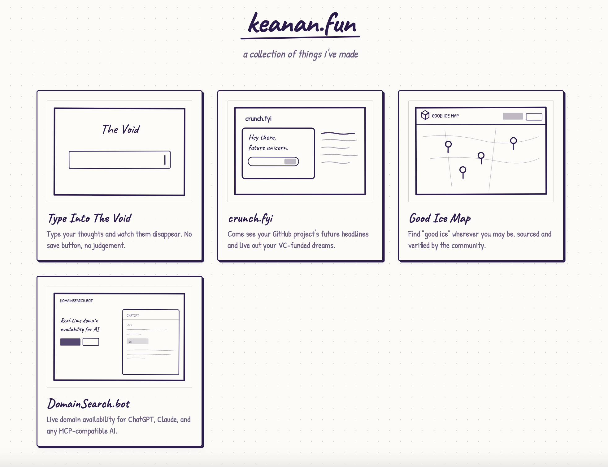

# keanan.fun

A personal portfolio showcasing a collection of side projects and creative experiments.

## Projects

### [EveryDomain.world](https://everydomain.world)
One name, every domain ending on Earth. Live availability across all 1,438 TLDs — and links to actually buy the open ones.

### [Type Into The Void](https://typeintothevoid.com)
Type your thoughts and watch them disappear. No save button, no judgement.

### [crunch.fyi](https://crunch.fyi)
Come see your GitHub project's future headlines and live out your VC-funded dreams.

### [Good Ice Map](https://goodicemap.com)
Find "good ice" wherever you may be, sourced and verified by the community.

### [Five Mile Walk](https://fivemilewalk.com)
Generate loop walking routes that start and end at the same spot. Hit your 10,000 steps without walking the same path twice.

### [DomainSearch.bot](https://domainsearch.bot)
Live domain availability for ChatGPT, Claude, and any MCP-compatible AI.

## Tech Stack

- Vanilla HTML, CSS, JavaScript
- No build tools or frameworks
- Google Fonts (Caveat, Patrick Hand)

## Running Locally

Just open `index.html` in your browser - no server required.

Or run `./serve` (optionally `./serve <port>`, defaults to 8000) to start a local dev server at http://localhost:8000.

## Design

Hand-drawn sketch aesthetic with:
- Dot-grid paper background
- Custom SVG illustrations for each project
- Staggered entrance animations
- Hover effects with depth

## Author

Made by [Keanan](https://www.linkedin.com/in/keanankoppenhaver/)
